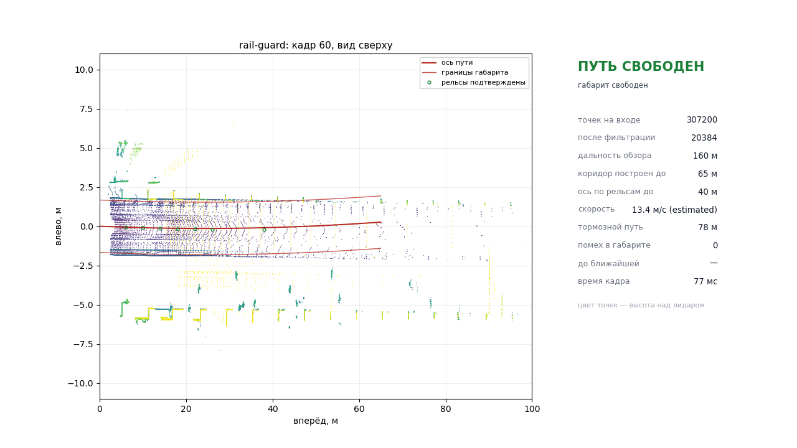

# rail-guard — обнаружение посторонних объектов в тоннеле метро по 3D-лидару

Система отвечает на один вопрос, который нужен беспилотному поезду: **есть ли
впереди что-то, чего там быть не должно, и на каком расстоянии**. На вход идёт
поток облаков точек, на выходе — решение по габариту (свободно / внимание /
служебное / экстренное торможение), список препятствий с положением,
размерами, классом и уверенностью и дальность до ближайшей помехи.

Главное требование к такой системе — **увидеть препятствие как можно раньше**,
чтобы поезд успел остановиться. Поэтому коридор габарита строится не по
экстраполяции рельсовой дуги, а по измеренной геометрии тоннеля, кандидаты
дальней зоны накапливаются по кадрам, и экстренное торможение выдаётся только
там, где положение пути доказано; на большей дальности — служебное, чтобы
снижать скорость заранее.

Ключевая идея — **не классифицировать объекты, а описывать нормальный
тоннель**. В тоннеле почти всегда пусто, размеченных примеров препятствий
нет, и учить нечему. Зато сам тоннель устроен предельно регулярно: рельсы
задают ось пути, ось задаёт габарит подвижного состава, а обделка задаёт
границу свободного пространства. Препятствие — это то, что попало в габарит
и при этом **не является границей свободного места и приближается со
скоростью поезда**. Все три признака геометрические, ни один не требует
обучающих данных, и все три переносятся на незнакомую запись.

Проверено на записях реальных проездов в тоннелях метро (шесть записей,
2488 кадров) и на открытом датасете OSDaR23 (магистральная линия, разметка
DZSF / DB Netz AG).

| | |
|---|---|
| Запуск | `docker build` → `docker run` → результат в терминале, RViz по желанию |
| Дальность обнаружения человека | до 100 м устойчиво (3-4 кадра из 6), до 120 м эпизодически; прежняя версия — 60 м |
| Достоверный коридор габарита | 105-135 м там, где узнаётся труба тоннеля (было 57-61 м) |
| Время кадра | 73-84 мс на 64-луче, 99 мс на 128-луче |
| Ложные экстренные торможения | 1 % кадров против 15 % у прежней версии (7368 прогонов кадра) |
| Что нужно от оператора | ничего: топик облака, ориентация датчика, скорость и период кадров определяются сами |

Подробности: [архитектура](docs/ARCHITECTURE.md) ·
[алгоритм](docs/ALGORITHM.md) · [эксперименты](docs/EXPERIMENTS.md) ·
[данные](docs/DATASET.md) · [результаты на OSDaR23](docs/RESULTS.md)



*Кадр работы системы: двухпутный тоннель, красным — ось пути и границы
габарита, кружками — ячейки, где ось подтверждена рельсами, справа — то, что
уходит в систему управления поездом. Видео работы (14 с) —
[`docs/demo.mp4`](docs/demo.mp4), собирается командой
`python3 scripts/make_demo_video.py`.*

## Быстрый старт

```bash
# 1. Сборка образа (внутри Ubuntu 22.04 + ROS 2 Humble)
docker build -t rail-guard .

# 2. Прогон записи: каталог с бэгами монтируется в /bags
docker run --rm -v /путь/к/for_hackathon:/bags:ro \
    rail-guard demo /bags/doubleT_platform
```

Больше ничего делать не нужно: контейнер сам проигрывает запись, сам находит
в ней топик облака, сам определяет ориентацию лидара, а по концу записи
печатает сводку и завершается. Если в `/bags` лежит ровно одна запись, имя
можно не указывать.

Вывод — одна строка на кадр и сводка в конце:

```
 кадр    точек   после  видит,м  путь,м  торм,м  помех    ближайшая помеха   скорость, м/с решение       мс
    1   307200   28099       65      28     199      0                   —    22.0 default свободен   227.6
    5   307200   28551       75      36      26      1     #3 крупный 64 м   7.5 estimated ВНИМАНИЕ    78.2
    6   307200   28678       55      16      93      0                   —      14.8 ≤6    свободен    77.1
   14   307200   28626       75      36      92      0                   —      14.7 ≤9    свободен    75.1
...
==============================================================================
Кадров обработано: 341
  путь свободен              169 (  50 %)
  внимание                   170 (  50 %)
  экстренное торможение        2 (   1 %)
Задержка обработки, мс: медиана 71.6, максимум 228.0; дольше периода лидара (100 мс) 1 кадров (0 %)
Частота обработки: 14.0 кадр/с по медианной задержке
Дальность мониторинга, м: медиана 61, максимум 105
Путь подтверждён (рельсы, затем обделка), м: медиана 36, максимум 64
Допустимая по обзору скорость, м/с: медиана 8.9; скорость выше допустимой в 100 кадрах (29 %)
Дальность обнаружения помехи, м: максимум 67, медиана 20
Уникальных треков за запись: 44
```

Колонка «путь,м» — дальность, на которой положение пути подтверждено; именно
она ограничивает, где система вправе требовать экстренного торможения. Запись
`≤9` в колонке скорости — диагностика: с такой скоростью поезд не успевает
остановиться в пределах подтверждённого пути. Решение это не меняет (габарит
свободен), но цифра уходит в `GaugeStatus` и показывает, где дальность
обнаружения ещё не покрывает тормозной путь.

В первом кадре скорости ещё нет — тормозной путь считается по значению из
профиля, а со второго её даёт оценка по облакам. Колонка «путь,м» — дальность,
на которой положение пути подтверждено: сначала рельсами, дальше обделкой
тоннеля. Именно она ограничивает, где система вправе требовать экстренного
торможения, и из неё же считается допустимая по обзору скорость.

До детектора доходит 92-93 % кадров записи; остальные система пропускает
осознанно, когда кадр приходит раньше, чем закончена обработка предыдущего.
Раньше на 128-луче доходило 58 %, и причина была не в транспорте, а в разборе
сообщения — разбор ускорен вдвое, подробности в
[EXPERIMENTS.md](docs/EXPERIMENTS.md#потери-кадров-где-они-на-самом-деле-были).

### Запись проигрывается на хосте

Если запись проигрывается снаружи (или подключён живой лидар), контейнеру
нужен только общий домен DDS:

```bash
docker run --rm --network host --ipc host -e ROS_DOMAIN_ID=0 rail-guard detect
ros2 bag play /путь/к/doubleT_platform          # в другом терминале, на хосте
```

### RViz

В образ RViz не входит — 400 МБ ради машины с дисплеем. Два способа:

```bash
# либо собрать образ вместе с ним и пробросить дисплей
docker build --build-arg WITH_RVIZ=true -t rail-guard:rviz .
docker run --rm -e DISPLAY -v /tmp/.X11-unix:/tmp/.X11-unix -e RVIZ=true \
    -v /путь/к/for_hackathon:/bags:ro rail-guard:rviz demo /bags/doubleT_platform

# либо запустить RViz на хосте рядом с контейнером в режиме detect
rviz2 -d ros2_ws/src/rail_guard_bringup/rviz/rail_guard.rviz
```

В RViz видно облако, границы габарита, ось пути (синим — подтверждённая
рельсами часть), рамки препятствий с классом и дальностью и текущее решение.

## Запуск без контейнера

Нужны Ubuntu 22.04, ROS 2 Humble, `python3-numpy`, `python3-scipy`.

```bash
cd ros2_ws
colcon build --symlink-install && source install/setup.bash

# демонстрация на записи
ros2 launch rail_guard_bringup metro.launch.py bag:=/путь/к/doubleT_platform

# только детектор — для живого лидара или внешнего проигрывания
ros2 launch rail_guard_bringup detector.launch.py points:=/os_cloud_node/points
```

## Параметры запуска

Аргументы `metro.launch.py`; те же значения entrypoint контейнера принимает
через переменные окружения `BAG`, `RATE`, `LOOP`, `RVIZ`, `POINTS_TOPIC`:

| Аргумент | По умолчанию | Назначение |
|---|---|---|
| `bag` | — | каталог записи rosbag2; пусто — ждать облако извне |
| `points` | пусто | топик облака; пусто — детектор находит его сам |
| `config` | `config/metro.yaml` | профиль параметров |
| `rate` | `1.0` | темп проигрывания записи |
| `loop` | `false` | проигрывать по кругу |
| `monitor` | `true` | построчный вывод результата и сводка |
| `rviz` | `false` | запустить RViz (нужен дисплей) |
| `debug_clouds` | `false` | публиковать отладочные облака |
| `route_valid_range`, `route_curvature` | `0.0` | ось пути из путевой карты линии |

Любой параметр алгоритма переопределяется из командной строки:

```bash
ros2 run rail_guard obstacle_detector --ros-args \
    --params-file config/metro.yaml \
    -p sensor.forward_axis:=-y -p sensor.up_axis:=z \
    -p gauge.half_width:=1.40 -p decision.default_speed:=12.0
```

## Конфигурация

Профиль линии задаёт **только физику**: габарит подвижного состава, колею,
междупутье, минимальный радиус кривой, тормозные характеристики и размер
наименьшего препятствия, которое система обязана видеть. Это всё, что нужно
заполнить, чтобы поехать на новой линии, — три десятка строк, и каждая берётся
из регламента, а не из записей.

Два профиля в `ros2_ws/src/rail_guard_bringup/config/`:

* **`metro.yaml`** — метрополитен: колея 1520 мм, габарит 2.8 × 3.75 м,
  междупутье 4.0 м, кривые от 150 м;
* **`mainline.yaml`** — магистральная линия: колея 1435 мм, габарит шире,
  междупутье 4.5 м, кривые от 250 м.

Всё остальное система измеряет по самим кадрам и выводит из профиля:

| Что | Как определяется |
|---|---|
| ориентация лидара | по геометрии первого пригодного кадра (`lib/frames.py`) |
| плотность лучей, дальнобойность | по кадрам, в переднем секторе (`lib/sensor_model.py`) |
| тоннель или открытый участок | по непрерывности боковой границы (`lib/scene.py`) |
| пороги числа точек, связность кластера | из плотности лучей и размера минимальной цели |
| длина коридора за зоной рельсов | из минимального радиуса кривой: ошибка дуги `Δ²/2R` |
| полосы поиска пути и полотна | из междупутья и измеренного сечения |
| потолок плотности облака | по фактическому времени кадра против периода лидара |

Посмотреть, что именно система измерила на ваших данных:

```bash
python3 scripts/measure_sensor.py --sequence <последовательность>
python3 scripts/measure_sensor.py --bag <запись> --frames 20
```

Скрипт печатает плотность лучей, ожидаемое число отражений от минимальной
цели по дальностям и предельную дальность обнаружения, а при наличии разметки
проверяет модель: сколько точек реально лежит внутри кубоидов размеченных
объектов против предсказания.

Файлы имеют формат параметров ROS 2, поэтому годятся и для `ros2 param`, и
для офлайн-скриптов. Что стоит знать при настройке под свою линию:

| Параметр | Что задаёт | Когда менять |
|---|---|---|
| `track.gauge` | расстояние между центрами головок рельсов | колея линии: 1.59 при 1520 мм, 1.505 при 1435 мм |
| `track.spacing` | междупутье — расстояние между осями смежных путей | норматив линии: метро 3.4-4.0 м, магистраль 4.1-4.5 м |
| `track.min_radius` | минимальный радиус кривой на линии | из плана линии; от него зависит, насколько далеко строится коридор |
| `gauge.half_width`, `gauge.height`, `gauge.bottom` | габарит подвижного состава | тип вагона |
| `decision.*` | замедления, время реакции, эксплуатационная скорость | тормозная характеристика поезда |
| `safety.min_target_*` | наименьшее препятствие, которое система обязана видеть | требование к системе; от него считаются все пороги детекции |
| `sensor.forward_axis`, `sensor.up_axis` | ориентация лидара | `auto` определяет сам; при известной установке лучше задать явно |

Любое выведенное значение можно подавить, задав число вместо `auto`, — тогда
автоматика для этого поля выключается, а остальные продолжают работать.
| `preprocess.decimate_below` | докуда прореживается ближнее поле (дальше не трогается) | ближе — если процессор не тянет; дальние точки резать нельзя |
| `gauge.adaptive_range`, `adaptive_min_range` | подстройка дальности под нагрузку | выключить, если частота кадров важнее дальности |
| `accumulate.frames` | сколько кадров сводится для дальней зоны | больше — дальше видно, но сильнее смаз при неточной скорости |
| `decision.min_points_brake` | сколько отражений нужно для команды торможения | меньше — раньше реакция, больше ложных |
| `objects.max_length` | длина вдоль пути, с которой кластер считается конструкцией | под ожидаемые препятствия; 8 м покрывает и строительное оборудование |
| `track.guide_enabled`, `track.guide_tolerance` | продление зоны доверия оси по обделке тоннеля | на открытом перегоне механизм сам себя отключает (границ нет) |
| `objects.overhead_clearance` | высота, выше которой всё считается сводом и консолями | высота тоннеля |
| `preprocess.max_input_points` | потолок плотности облака | под процессор стенда: меньше значение — быстрее кадр |
| `decision.*` | тормозные характеристики и время реакции | под подвижной состав |
| `route_curvature`, `route_heading`, `route_valid_range` | ось пути из путевой карты | на метрополитене геометрия маршрута известна заранее — тогда коридор достоверен на всю дальность обзора |

## Интерфейсы

Ноды: **`obstacle_detector`** (весь тракт), **`result_monitor`** (вывод
результата в терминал и сводка по проезду), **`dataset_player`**
(воспроизведение OSDaR23). Топики и потоки данных —
[docs/ARCHITECTURE.md](docs/ARCHITECTURE.md).

Подписки: облако (`sensor_msgs/PointCloud2`, имя любое) и `/train/speed`
(`std_msgs/Float32`, м/с). Скорость не обязательна: без неё она оценивается
по самим облакам, а источник (`odometry` / `estimated` / `default`) уходит в
`GaugeStatus` — принимающая сторона должна знать, на чём построен тормозной
расчёт.

Подписка на облако — `RELIABLE`, глубина 2: кадр 8-24 МБ идёт фрагментами по
64 КБ, и при `BEST_EFFORT` потеря одного фрагмента отбрасывает весь кадр.
Если издатель публикует `BEST_EFFORT` (так делают драйверы части лидаров),
нода это замечает и добавляет совместимую подписку — иначе несовместимость
QoS означала бы полное отсутствие данных.

Кроме решения, в `GaugeStatus` уходит `confident_range` — дальность, на
которой положение пути подтверждено, — и `max_safe_speed`: скорость, при
которой поезд успевает остановиться в пределах этой дальности. Ограничение по
видимости не меняет решение (помех нет — габарит свободен), но система
управления получает его в каждом кадре.

## Соответствие требованиям ТЗ

| Требование | Где реализовано |
|---|---|
| Запуск в Docker, чтение bag, вывод результата | `Dockerfile`, `docker/entrypoint.sh`, `metro.launch.py`, `result_monitor` |
| Обнаружение объектов в зоне габарита, дальность до ближайшего | `lib/track.py` (коридор), `lib/detect.py`, `lib/decision.py` |
| Работа на незнакомой записи без ручной настройки | автоопределение топика (`obstacle_detector`), ориентации датчика (`lib/frames.py`), скорости (`lib/egomotion.py`), периода лидара (по штампам кадров) |
| Реакция, при которой поезд успевает остановиться | решение сравнивает дальность с тормозным путём; экстренное — только в зоне, где путь подтверждён рельсами; за ней служебное торможение; в каждом кадре публикуется допустимая по дальности обзора скорость (`lib/decision.py`, `safe_speed`) |
| Минимум ложных срабатываний | отсечка поверхности полотна, модель свободного пространства (`lib/tunnel.py`), подтверждение N из M кадров, кинематический гейт, фильтры инфраструктуры по длине и высоте |
| Реальное время | один проход по облаку, потолок плотности, прореживание при разборе сообщения, замер задержки в каждом кадре и в сводке |
| Обобщаемость | профиль содержит только физику линии (габарит, колея, междупутье, радиус кривой, торможение, минимальная цель); свойства датчика и тип сцены измеряются по кадрам, пороги детекции выводятся из них формулами — см. [архитектуру](docs/ARCHITECTURE.md#откуда-берутся-параметры) |
| Тесты | `ros2_ws/src/rail_guard/test/` — 47 проверок, прогоняются при сборке образа |
| Документация | этот файл, [архитектура](docs/ARCHITECTURE.md), [алгоритм](docs/ALGORITHM.md), [эксперименты](docs/EXPERIMENTS.md) |
| Видео работы | `scripts/make_demo_video.py` собирает MP4 из результата пайплайна |

## Проверка на открытых данных (OSDaR23)

Записи с поезда на магистральной линии с эталонной разметкой — единственный
доступный способ измерить точность оси пути и дальность детекции по
размеченным целям. Данные качаются скриптом, в репозиторий не входят:

```bash
./scripts/download_osdar23.sh
./scripts/run_benchmark.sh      # весь набор метрик, результат в docs/benchmark_output.txt
```

Итоги — [docs/RESULTS.md](docs/RESULTS.md).

## Офлайн-прогон и видео

Без ROS-транспорта, тот же объект `Pipeline`, что и в ноде:

```bash
# прогон по записи метро: все кадры, без потерь на транспорте
python3 scripts/run_offline_bag.py --bag /путь/к/doubleT_platform
python3 scripts/run_offline_bag.py --bag /путь/к/doubleT_platform --quiet --stages --reasons
# сравнение вариантов алгоритма: любой параметр переопределяется
python3 scripts/run_offline_bag.py --bag /путь/к/doubleT_platform --quiet \
        --set tunnel.enabled=false gauge.extrapolation_margin=0

# то же для последовательностей OSDaR23 и картинка одного кадра
python3 scripts/run_offline.py --sequence 9_station_ruebenkamp_9.1 \
        --config ros2_ws/src/rail_guard_bringup/config/mainline.yaml
python3 scripts/plot_frame.py --sequence 9_station_ruebenkamp_9.1 --frame 9

# видео работы
python3 scripts/make_demo_video.py --bag /путь/к/doubleT_platform --out docs/demo.mp4
```

Этими скриптами измерены все цифры [docs/EXPERIMENTS.md](docs/EXPERIMENTS.md);
запускать их нужно в окружении с ROS 2 — для чтения записи нужен `rosbag2_py`.

## Тесты

```bash
cd ros2_ws/src/rail_guard && PYTHONPATH=. python3 -m pytest test/ -q
```

30 проверок на синтетических сценах с заранее известным ответом: поиск оси на
прямой и в кривой, предмет в габарите и рядом с ним, классификация человека,
приведение системы координат при развёрнутом и перевёрнутом датчике, отсев
конструкций на границе свободного места, оценка скорости по облакам,
кинематический гейт, обрезка коридора по зоне доверия оси, продление зоны
доверия обделкой тоннеля (и то, что труба не переписывает рельсовую ось),
обратимость «тормозной путь ↔ допустимая скорость», ограничение реакции за
зоной подтверждения, снятие поверхности полотна без потери предмета на ней,
отсев склеек длиной больше 8 м, стабильность решётки прореживания между
кадрами, перенос оси вперёд при потере сечения пути, отбрасывание скачка
скорости, класс по треку вместо покадрового, отсев кластера от полотна до
свода.

## Как система добивается дальности

Дальность обнаружения ограничивают три вещи, и каждая решается отдельно:

1. **Где проходит путь.** Рельсы видны на 30-40 м; дальше ось ведёт обделка
   тоннеля — по измеренным центрам полос, а не по продолжению дуги (ошибка
   экстраполяции растёт как `s²/2R` и на 100 м достигает 12 м). Достоверный
   коридор — 105-135 м там, где труба узнаётся.
2. **Сколько точек приходит от цели.** На 100 м от человека приходит
   14 отражений, и по одному кадру они рассыпаются. Кандидаты дальней зоны
   сводятся по пяти кадрам с компенсацией пройденного пути — кластер
   собирается там, где одного кадра не хватало.
3. **Доходят ли эти точки до алгоритма.** Потолок плотности режет только
   ближнее поле (97 % точек кадра лежат ближе 20 м), рабочая зона по высоте
   расширена под уклон пути, а разбор сообщения ускорен вдвое.

Измерено подстановкой цели в реальные кадры:
[EXPERIMENTS.md](docs/EXPERIMENTS.md#6-дальность-обнаружения-сколько-метров-даёт-каждый-механизм).

## Ограничения

Честный список — [docs/EXPERIMENTS.md](docs/EXPERIMENTS.md) и
[docs/RESULTS.md](docs/RESULTS.md). Главные:

* в записях метро нет эталонной разметки, поэтому доля ложных срабатываний
  измерена как поведение системы, а не как метрика качества: развести правду
  и ошибку можно только по разметке или по просмотру записей. Дальность
  обнаружения измерена подстановкой цели в реальные кадры — это даёт истинно
  положительные, которых в записях почти нет;
* на 128-луче (921 тыс. точек, 24 МБ на кадр) система обрабатывает примерно
  каждый второй кадр: 100-104 мс при периоде 100 мс. Обмен сознательный —
  дальность 130 м при 5-7 кадрах в секунду полезнее, чем 57 м при десяти;
  при нехватке времени система сама уступает сначала плотность ближнего поля,
  потом дальность;
* за подтверждённой рельсами зоной положение оси — экстраполяция дуги, и в
  узком тоннеле это главный источник ошибок; лечится путевой картой линии;
* выбор ветви за стрелкой по облаку точек однозначно не решается;
* препятствием считается то, что выступает над уровнем головок рельсов на
  13 см и выше (низ габарита 5 см — нижняя кромка вагона — плюс 8 см видимой
  высоты). Всё, что ниже, поезд проходит без контакта, а вот путевое
  оборудование — шпалы, накладки, кабельные лотки — лежит именно там, и
  опущенная под УГР граница ловила его как препятствие;
* тонкая полоса вдоль пути (тоньше 30 см, длиннее метра) считается
  инфраструктурой: опасный предмет такой формы не встречается, но лежащий
  вдоль пути узкий груз система пропустит.
