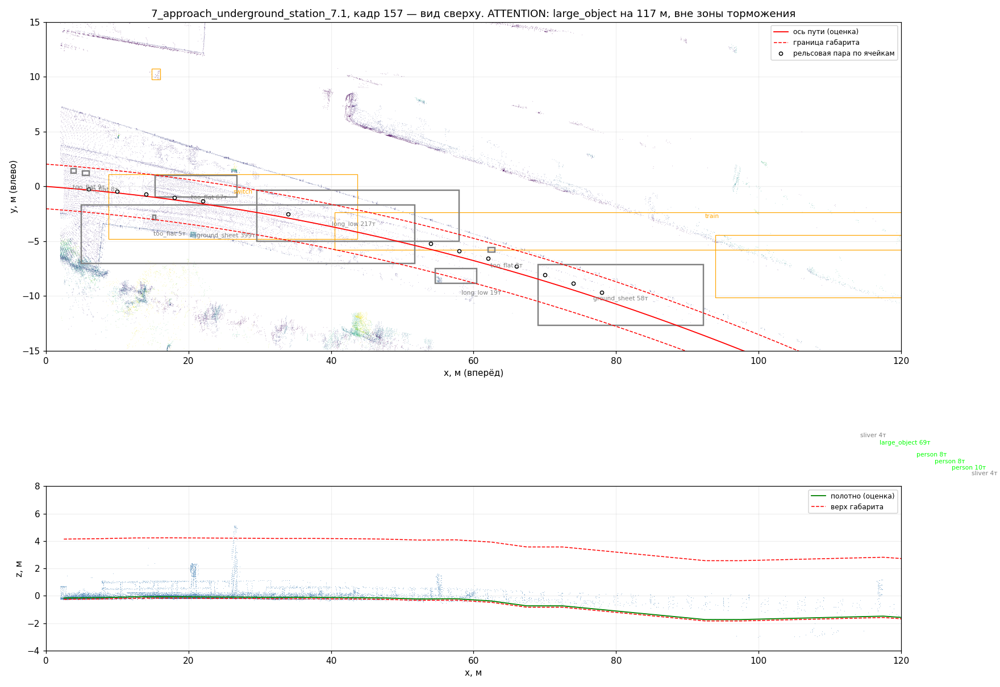

# rail-guard — мониторинг габарита беспилотного поезда по 3D-лидару

Программный комплекс на ROS 2, который следит за пространством перед поездом,
находит посторонние объекты в зоне, ограниченной габаритом подвижного состава,
и выдаёт результат в виде, пригодном для системы принятия решений.

Проверен **на реальных записях лидара с поезда** (датасет OSDaR23, DZSF /
DB Netz AG, CC-BY 4.0): 30 кадров, три сцены — прямой перегон, платформа,
спуск к подземной станции в кривой R ≈ 250 м.

| Что измерено | Значение |
|---|---|
| Обнаружение человека в габарите | до **160 м** (команда торможения до 140 м с путевой картой) |
| Обнаружение предмета 40 см | до **60 м** |
| Точность оси пути в ближней зоне | **0.02-0.26 м** |
| Ложные экстренные торможения | **0** на 30 кадрах |
| Ложные служебные торможения | 2 на 30 кадрах (обе — в тугой кривой без путевой карты; с ней — 0) |
| Время обработки кадра | **53-100 мс** при 140-190 тыс. точек, поток 10 Гц выдерживается |

Подробности и полный вывод прогона — [`docs/RESULTS.md`](docs/RESULTS.md).



*Кривая R ≈ 250 м на подходе к подземной станции. Красным — ось пути и границы
габарита, серым — кластеры, отклонённые как путевое оборудование (стрелочные
тяги, настил, балласт), кружками — ячейки, где рельсы подтвердили ось.*

## Быстрый старт

```bash
# 1. Данные (три последовательности, ~2.2 ГБ) — качаются с хоста
./scripts/download_osdar23.sh

# 2. Сборка и запуск — в окружении с ROS 2 Humble.
#    На этой машине это distrobox-контейнер ros-gazebo:
distrobox enter ros-gazebo
source /opt/ros/humble/setup.bash
cd ~/Projects/metro-lidar-guard/ros2_ws
colcon build --symlink-install && source install/setup.bash

# 3. Воспроизведение записи + мониторинг + RViz
ros2 launch rail_guard_bringup replay_osdar23.launch.py \
    sequence:=$PWD/../data/osdar23/sequences/9_station_ruebenkamp_9.1 \
    config:=$PWD/src/rail_guard_bringup/config/osdar23.yaml
```

В RViz видно: облако лидара, границы габарита, найденную ось пути (синим —
только та часть, что подтверждена рельсами), рамки препятствий с классом,
дальностью и уверенностью, и текущее решение.

Без ROS, только алгоритм и метрики. Эти скрипты запускаются **с хоста**: если
numpy и scipy найдены только в контейнере, они сами перезапускаются в нём
(контейнер задаётся переменной `RAIL_GUARD_CONTAINER`, по умолчанию
`ros-gazebo`):

```bash
python3 scripts/run_offline.py --sequence 9_station_ruebenkamp_9.1 \
        --config ros2_ws/src/rail_guard_bringup/config/osdar23.yaml
python3 scripts/plot_frame.py  --sequence 9_station_ruebenkamp_9.1 --frame 9
./scripts/run_benchmark.sh          # весь набор метрик
```

## Что и как решает задачу

| Требование ТЗ | Где реализовано |
|---|---|
| ROS 2-ноды загрузки и обработки облаков | `dataset_player`, `obstacle_detector` |
| Фильтрация, сегментация, анализ 3D-данных | `lib/preprocess.py`, `lib/ground.py`, `lib/cluster.py` |
| Детекция объектов в зоне габарита | `lib/track.py` (коридор), `lib/detect.py` |
| Максимальная дальность | адаптивное прореживание, порог по точкам ∝ 1/r², дальнобойный сектор не прореживается вовсе |
| Минимум ложных срабатываний | подтверждение N из M кадров, семь физически обоснованных фильтров инфраструктуры, гейтинг по зоне доверия оси пути |
| Интерфейсы для смежных подсистем | пакет `rail_guard_msgs`, топики ниже |

Алгоритм и обоснование каждого решения — [`docs/ALGORITHM.md`](docs/ALGORITHM.md).

## Интерфейсы

Ноды:

* **`dataset_player`** — воспроизводит запись в темпе съёмки: облако,
  скорость поезда из бортовой навигации, эталонная разметка. Заменяется на
  драйвер реального лидара без изменений в остальной системе.
* **`obstacle_detector`** — весь тракт обработки. Промежуточные результаты
  доступны отладочными топиками, но внутри ноды не сериализуются: разбиение
  по нодам стоило бы двух копий облака на 150 тыс. точек в каждом кадре.

Публикуемые топики:

| Топик | Тип | Назначение |
|---|---|---|
| `/rail_guard/obstacles` | `rail_guard_msgs/ObstacleArray` | препятствия кадра: положение, габариты, класс, уверенность, скорость сближения, время до контакта |
| `/rail_guard/gauge_status` | `rail_guard_msgs/GaugeStatus` | сводное решение: свободно / внимание / служебное / экстренное + обоснование |
| `/rail_guard/track_corridor` | `rail_guard_msgs/TrackCorridor` | ось пути, полуширина и высота габарита, радиус кривой, дальность достоверности |
| `/rail_guard/markers` | `visualization_msgs/MarkerArray` | визуализация для RViz |
| `/rail_guard/points_filtered`, `/rail_guard/points_in_gauge` | `sensor_msgs/PointCloud2` | отладочные облака |

Подписки: `/lidar/points` (`sensor_msgs/PointCloud2`), `/train/speed`
(`std_msgs/Float32`, м/с — от неё считается тормозной путь; протухшая
скорость игнорируется).

Сообщения намеренно сделаны самодостаточными: получатель принимает решение,
не заглядывая в облако точек. Для интеграции в существующий CV-пайплайн
`ObstacleArray` переводится в `vision_msgs/Detection3DArray` один в один —
поля `centroid`, `size`, `classification`, `confidence` заполнены для этого.

## Настройка под свою линию

Два готовых профиля параметров:

* `config/metro.yaml` — метрополитен: колея 1520 мм, габарит 2.8 × 3.75 м,
  тоннель (соседних путей нет, свод и кабельные консоли выше 2.6 м);
* `config/osdar23.yaml` — магистральная линия датасета: колея 1435 мм,
  габарит шире, рядом до трёх соседних путей.

Файлы имеют формат параметров ROS 2, поэтому годятся и для `ros2 param`, и
для офлайн-скриптов. Любой параметр переопределяется из командной строки.

**Ось пути из путевой карты.** На метрополитене геометрия маршрута известна
заранее; параметры `route_curvature`, `route_heading`, `route_valid_range`
задают ось извне, и коридор становится достоверным на всю дальность обзора.
Измеренный эффект: команда торможения по человеку — до 140 м вместо 60 м,
ложные торможения в кривой — 0 вместо 2.

## Структура

```
data/osdar23/          записи датасета (в репозиторий не входят)
docs/                  алгоритм, результаты, данные
scripts/               загрузка данных, офлайн-прогон, метрики, визуализация
ros2_ws/src/
  rail_guard_msgs/     сообщения: Obstacle, ObstacleArray, GaugeStatus, TrackCorridor
  rail_guard/
    lib/               алгоритм без зависимости от ROS (тестируется отдельно)
    nodes/             ROS 2-ноды
    test/              10 тестов на синтетических сценах
  rail_guard_bringup/  launch-файлы, профили параметров, конфигурация RViz
```

Алгоритмическая часть намеренно не зависит от ROS: тот же объект `Pipeline`
работает и в ноде, и в офлайн-оценке качества — иначе метрики мерили бы не
то, что поедет на поезде.

```bash
cd ros2_ws/src/rail_guard && PYTHONPATH=. python3 -m pytest test/ -q
```

## Ограничения

Честный список — в [`docs/RESULTS.md`](docs/RESULTS.md#5-известные-ограничения).
Главные: в тугой кривой без путевой карты экстраполяция оси за 40 м даёт до
8 м ошибки; предметы ниже 20 см сознательно не считаются препятствиями;
выбор ветви за стрелкой из облака точек однозначно не решается; открытых
лидарных записей из тоннелей метро не существует, поэтому тоннельная
специфика проверена только на портале подземной станции.
