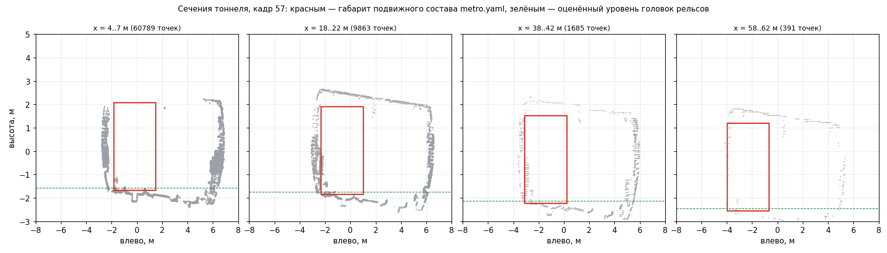

# Как устроен тракт обработки

Один кадр лидара проходит десять этапов. Каждый следующий работает с всё
меньшим числом точек, поэтому дорогие операции достаются только тем точкам,
которые действительно могут оказаться препятствием.

```
облако 300 000 точек (128-луч — 920 000)
   │
   ├─ 0. приведение СК ───────────► X вперёд, Y влево, Z вверх
   ├─ 0а. измерение датчика ──────► плотность лучей, дальнобойность
   ├─ 1. фильтрация ──────────────► ~20 000-40 000 точек
   ├─ 2. поверхность полотна ─────► профиль высоты по ячейкам
   ├─ 3. ось пути по рельсам ─────► дуга y = b·x + a·x²  + зона доверия
   ├─ 4. коридор габарита ────────► ~1 000 точек внутри габарита
   ├─ 5. распознавание сцены ─────► тоннель или открытый участок
   ├─ 6. свободное место тоннеля ─► граница обделки по полосам и слоям
   ├─ 7. снятие шума и рельсов ───► ~800 точек
   ├─ 8. кластеризация и отсев ───► 0-5 объектов
   ├─ 9. скорость носителя ───────► м/с (одометрия или оценка по облакам)
   └─ 10. сопровождение и решение ► ObstacleArray + GaugeStatus
```

Этапы 0, 6 и 9 добавлены после прогона на записях метрополитена — см.
[EXPERIMENTS.md](EXPERIMENTS.md), где измерено, что каждый из них даёт.
Этапы 0а и 5 появились позже: они убирают из тракта настройки, снятые с
конкретного лидара и конкретного участка, и заменяют их измерением.

## 0. Приведение системы координат (`lib/frames.py`)

Весь алгоритм считает, что вперёд — это `X`: по `X` идут обрезка рабочей
зоны, ячейки профиля пути, полосы прореживания. Лидар же стоит как встал:
в записях метрополитена продольная ось датчика — `-Y`, в OSDaR23 — `+X`.

Облако в чужой СК не ломает тракт громко: предфильтр выбрасывает 99.8 %
точек, и система штатно рапортует «путь свободен». Поэтому нормализация
сделана явным первым этапом, а не подразумевается.

Ориентацию можно задать параметрами (`sensor.forward_axis`, `sensor.up_axis`),
а можно оставить `auto` — тогда она восстанавливается из самого облака по
двум признакам, не зависящим ни от среды, ни от модели лидара:

* **вертикаль** — самая «сжатая» ось: тоннель тянется на сотни метров вперёд
  и на десяток в стороны, но по высоте всегда единицы метров;
* **продольная ось** — односторонняя: лидар смотрит вперёд, и почти все точки
  лежат по одну сторону от датчика, тогда как поперечная ось симметрична.

Знак вертикали определяется по асимметрии распределения: под полотном
отражаться нечему, поэтому облако упирается в полотно снизу и растягивается
вверх — к стенам, своду, опорам. Признак не зависит от того, где начало
координат: на уровне датчика или на уровне пути.

Решение принимается один раз, по первому кадру, где данных достаточно, и
фиксируется на всю запись: ориентация установки в пределах проезда не
меняется, а пересчёт по каждому кадру дал бы дрожание осей. Разворот — это
знаковая перестановка столбцов, а не матричное умножение: на 920 тысячах
точек втрое дешевле при том же результате.

## 0а. Измерение датчика (`lib/sensor_model.py`)

Все пороги детекции упираются в одну величину — сколько отражений даёт цель
известного размера на известной дальности. Она равна

```
N = fill · k · A / r²
```

где `A` — фронтальная площадь цели, `r` — дальность, `k` — **плотность лучей
в телесном угле** (точек на стерадиан), `fill` — доля лучей, дающих полезный
возврат. Первый множитель — чистая геометрия: цель занимает телесный угол
`A/r²`, и в него попадает `k·A/r²` лучей.

`k` — свойство комплекта лидаров, и система измеряет его сама по приходящим
кадрам. Точки переводятся в сферические координаты, раскладываются по сетке
(азимут, элевация), и `k` = число точек, делённое на телесный угол занятых
ячеек. Размер ячейки подбирается по самому облаку — берётся наименьший, при
котором в занятой ячейке набирается несколько точек: так оценка одинаково
работает и для 16-лучевого лидара с шагом в два градуса, и для сводного
облака из шести датчиков с нерегулярной сеткой. Лучи, ушедшие в небо и не
вернувшиеся, в знаменатель не попадают.

**Меряется не всё поле зрения, а передний сектор.** У комплекта из нескольких
лидаров (в OSDaR23 — Pandar64 на 360° плюс три Livox Tele-15 вперёд)
плотность впереди на порядок выше, чем по кругу, и средняя по кадру величина
не описывает ни одно реальное направление. Сектор — это угловой размер
габаритного коридора с запасом на уход оси в кривой; он вычисляется из
профиля носителя, а не задаётся числом.

`fill` — единственный коэффициент модели, и он тоже измеряется, а не
подбирается: `scripts/measure_sensor.py` считает по размеченному датасету,
сколько точек реально лежит внутри кубоида каждого объекта, и делит на
предсказание. На OSDaR23 медиана по всем размеченным объектам — 0.56, по
людям — 0.72 (силуэт занимает не весь габаритный прямоугольник, тёмная
поверхность и косой угол падения съедают часть). В профиле стоит
консервативные 0.5.

Раньше на месте всего этого стояла константа `7.8e5`, снятая с комплекта
OSDaR23. На вдвое более редком лидаре она означала бы вдвое завышенную
дальность обнаружения, и узнать об этом было неоткуда.

## 1. Фильтрация (`lib/preprocess.py`)

Обрезка рабочей зоны, отсечение отражений от собственного носа поезда и
воксельное прореживание **по полосам дальности**: ближнее поле избыточно
плотное и режется вокселем 12 см, дальнее (за 60 м) не прореживается вовсе.
Прореживать дальнее поле нельзя — на нём и держится дальность детекции,
ради которой всё затевается.

Сверху стоит потолок на размер входного облака, и он **вырабатывается по
факту**, а не задаётся числом: тракт меряет собственное время кадра и период
лидара по штампам сообщений, и когда перестаёт укладываться в период —
уступает плотность ближнего поля шагами, а когда запас появляется, возвращает
её обратно. Дальность уступается только после того, как прореживать станет
некуда, и не ниже тормозного пути. Число в профиле означало бы настройку под
конкретный процессор — на объекте он другой, и система либо теряла бы кадры,
либо зря отдавала дальность. Шаг прореживания берётся по индексу: точки в
облаке идут по лучам, поэтому равномерный шаг режет угловое разрешение
однородно и не выедает ни один сектор.

Здесь же считается признак вырожденного кадра: если после фильтрации осталось
меньше 2 % точек, значит облако пришло в чужой СК, датчик закрыт или рабочая
зона задана неверно. Такой кадр не «свободный путь», и нода говорит об этом
ошибкой в лог, а не молчанием.

## 2. Поверхность полотна (`lib/ground.py`)

Одна плоскость на всё поле зрения не годится: на 150 м уклон 1 % даёт
1.5 м ошибки по высоте — ровно тот масштаб, на котором насыпь превращается
в «препятствие», а лежащий предмет исчезает.

Полотно описывается кусочно, ячейками по 5 м, и **ведётся от ближней ячейки
к дальней** с ограничением на уклон. Перцентиль по широкой полосе не
работает: у платформы, в выемке перед порталом тоннеля или рядом с
водоотводом в полосу попадают точки на два метра ниже полотна, и «землёй»
объявляется дно канавы. Слежение с ограничением уклона от этого защищает.

Поперечный наклон (возвышение наружного рельса в кривой) оценивается МНК
внутри ячейки и отсчитывается **от оси пути**, а не от нулевой поперечной
координаты: в кривой ось уходит на десяток метров вбок, и абсолютная
координата дала бы метровую ошибку высоты.

## 3. Ось пути (`lib/track.py`)

Габарит имеет смысл только относительно того пути, по которому поезд
реально поедет. «Прямо вперёд» — неверный ответ: в кривой R = 250 м ось
уходит на 10 м вбок уже к 70 метрам, и коридор либо накрывает соседний путь
(ложные тревоги), либо теряет собственный (пропуск препятствия).

Оценка идёт **сопоставлением поперечного сечения с шаблоном пути**, а не
поиском отдельных рельсов. Причина видна на реальных данных: головка рельса
поднимается над балластом всего на 15-25 см и при скользящем угле падения
даёт считанные отражения — гистограмма поперечной координаты рельсовых
пиков просто не показывает. Зато устойчиво различима *форма сечения*: два
бугра на полшага колеи и провал между ними.

* Строится профиль: продольные ячейки по 4 м × поперечные полосы по 5 см,
  значение — число точек «рельсовой» высоты (10-32 см над балластом).
* Шаблон даёт плюс на местах головок рельсов и минус в середине колеи и
  сразу снаружи. Разностная форма не реагирует ни на общий уровень балласта,
  ни на широкие сооружения вдоль пути.
* Гипотезы — дуги `y = b·x + a·x²` через начало координат (поезд физически
  стоит на своём пути, значит ось проходит через нос). Перебор идёт по
  сетке курса и кривизны, затем уточняется.
* **Ограничение непрерывности**: на дальности 50 м ось не может уйти от
  оси прошлого кадра дальше, чем на 1.5 м. Соседний путь отстоит на 4.5 м
  уже там — без этого ограничения оценка на первой же стрелке уезжает на
  него. Плата — выход на кривую за 3-4 кадра (треть секунды).
* Ячейки взвешиваются с падением по дальности: три-четыре точки на 100 м
  не должны перевешивать сотни на 20 м.

**Зона доверия** (`fit_range`) — до какой дальности рельсы реально видны
(не менее шести отражений на обе нитки в ячейке). Дальше ось экстраполируется
дугой, а уверенность детекций падает: заявлять о вторжении в габарит там,
где неизвестно, где путь, — главный источник ложных торможений.

**Ось за рельсовой зоной — измеренная, а не экстраполированная**
(`estimate_tunnel_center`). Рельсы различимы на первых 30-40 м — дальше
отражений от головки не хватает. Обделка видна на 80-110 м: это сплошная
поверхность под скользящим углом. А путь лежит в трубе с постоянным смещением
от неё, и это смещение можно измерить как раз там, где рельсы ещё видны.

Ключевое: за рельсовой зоной коридор идёт **по измеренным центрам полос**, а
не по продолжению дуги. Ошибка экстраполяции дуги растёт как `s²/2R` — на
100 м при R = 400 м это 12 м, то есть полтора тоннеля вбок. Тоннель же на
этих 100 м виден, и его геометрия — измерение, а не предположение. Стык с
рельсовой дугой сшивается по значению, чтобы коридор не имел излома.

* по полосам дальности (10 м) меряются левая и правая границы тоннеля на
  высоте 0.6-2.4 м над УГР — выше полотна, ниже свода и кабельных консолей;
* полосы, где ширина отличается от ближней части тоннеля больше чем на
  1.2 м, отбрасываются: это платформа, камера съезда или расширение перед
  гермозатвором, и к оси пути они отношения не имеют;
* проверяются три опоры — центр трубы, левая стена, правая стена; берётся
  та, чьё смещение до рельсовой оси наименее разбросано по ближним полосам,
  а при сравнимом разбросе — та, что измерена в большем числе полос. В
  однопутном круглом тоннеле это центр (смещение около нуля), в двухпутном —
  своя стена: дальняя там экранирована и за 50 м уже не видна, поэтому одной
  стены достаточно (требование «видеть обе» обрывало зону доверия вдвое
  раньше, чем нужно);
* дальше зона доверия растёт по непрерывной цепочке полос, где ось «по трубе»
  расходится с дугой не больше чем на 0.4 м — боковой запас габарита.

В рельсовой зоне ось остаётся рельсовой: труба уточняет её только на
дальности. Подгонка общей дуги по трубе проверялась (`guide_refits_axis`) и по
умолчанию выключена — сдвиг ближней зоны даже на 10-15 см добавлял ложных
тревог у границы габарита. Измеренный эффект: зона доверия 32 → 80-90 м на
записях, где труба узнаётся, коридор 57 → 105 м.

**Внешняя ось** (`Pipeline.set_route_prior`, параметры `route_*` у ноды).
На метрополитене геометрия маршрута известна заранее из путевой карты, и
лидару остаётся её подтвердить, а не выводить с нуля. Тогда коридор
достоверен на всю дальность обзора; измеренный эффект — см. `RESULTS.md`.

## 4. Коридор габарита (`lib/track.py`, `build_corridor`)

Габарит подвижного состава протягивается вдоль найденной оси: полуширина
кузова + запас на раскачку и погрешность оси + расширение в кривой
(вынос кузова `L²/8R`). Нижняя граница — чуть ниже уровня головок рельсов,
чтобы видеть предметы между рельсами; верхняя — по высоте вагона.

Длина коридора ограничена зоной доверия оси (рельсы, а за ними подтверждение
обделкой) плюс запас. Запас не задаётся числом, а следует из геометрии линии:
за подтверждённой зоной ось — продолжение дуги, и если впереди начинается
кривая минимального для линии радиуса, продолжение уходит от истинного пути
на `Δ²/2R`. Коридор строится ровно до той дальности, где эта ошибка ещё не
превысила его полуширины, — дальше он может промахнуться мимо пути целиком и
накрыть соседний путь или обделку. Для метрополитена (`R = 150` м, полуширина
1.65 м) это 22 м, для магистральной линии (`R = 250` м, полуширина 1.85 м) —
30 м. Раньше здесь стояло 25 м для метро и «не ограничивать» для магистрали;
второе и было причиной того, что в кривой `R ≈ 250` коридор смотрел на
соседний путь. Если ось задана извне (путевая карта
линии, параметры `route_*`), зона доверия задаётся картой и ограничение не
срабатывает — коридор строится на всю дальность обзора.

## 5. Распознавание сцены (`lib/scene.py`)

Три механизма тракта имеют смысл только в замкнутом сечении: модель
свободного пространства, ведение оси обделкой и короткий предел экстраполяции
коридора. Раньше это задавалось профилем — `tunnel.enabled: true` для метро,
`false` для магистральной линии. Но профиль пишется до поездки и действует на
всю запись, а поезд метро выезжает на открытый участок, магистральный
въезжает в тоннель, и обе системы в этот момент работают не по той модели
сцены, в которой едут.

Признак замкнутости — **не ширина, а непрерывность границы**. Абсолютный
порог («стена ближе восьми метров») пришлось бы подбирать под конкретный
тоннель. Вместо него проверяется то, что отличает обделку от чего угодно
другого: она тянется вдоль пути и попадает почти в каждую полосу дальности с
обеих сторон, тогда как предмет, опора или край платформы занимают одну-две.
Порог доли полос — тот же, что в модели свободного пространства, и выводится
из максимальной длины предмета.

Слой, в котором ищутся стены, задаётся не абсолютными отметками, а долями
высоты габарита носителя: так признак переносится на любую линию вместе с
профилем. Перекрытием считается то, что находится выше габарита.

Решение принимается по большинству последних кадров, а не по одному:
у платформы и на стрелке признаки замкнутости то появляются, то пропадают, и
механизмы тракта не должны от этого мигать. Пока сцена не распознана (первые
кадры записи), механизмы работают: модель свободного пространства сама
окажется пустой там, где границ нет, а ведение оси само не найдёт опоры.
Выключение — это решение, и принимать его можно только по измерению.

## 6. Модель свободного пространства тоннеля (`lib/tunnel.py`)

Главный источник ложных торможений в тоннеле — не шум и не слабые кластеры,
а сама стена. Отличить её от предмета по размеру или плотности нельзя: на
60 метрах от обделки приходит такой же десяток точек, как от человека. Но у
стены есть свойство, которого нет у предмета: **она — граница свободного
пространства**.

Поэтому тоннель описывается так, как он и выглядит из кабины. Для каждой
полосы дальности и каждого слоя высоты над УГР (0.4 м) измеряется, как далеко
вбок от оси пути уходит свободное место: границей считается **третья точка с
внешнего края** ячейки. Раньше здесь стоял квантиль, и его значение
приходилось подбирать: на плотной ячейке высокий квантиль съезжает внутрь (у
полотна отражения собраны у оси), а максимум улетает наружу по одиночному
случайному возврату. Порог в отражениях от населённости ячейки не зависит и
означает ровно то, что нужно: одиночный возврат — не поверхность, а несколько
подряд — уже она.

Длина полосы — половина максимальной длины предмета (`objects.max_length`),
чтобы предмет не мог заполнить собой столько полос, сколько заполняет стена.

Граница считается границей только если она **непрерывна вдоль пути**:
обделка, кабельный лоток и край платформы попадают почти в каждую полосу
дальности, а предмет занимает одну-две. Порог доли заполненных полос тоже
выводится, а не подбирается: предмет длиной `L` закрывает не больше
`L/полоса + 1` полос, и всё, что присутствует в большем их числе, предметом
быть не может. Слой, заполненный реже, объявляется «границы на этой высоте
нет» — иначе на высоте, где кроме предмета ничего нет, моделью границы стал
бы сам предмет, и он был бы отвергнут. Продольное сглаживание медианой по соседним
полосам восстанавливает ту стену, которую предмет закрыл собой.

Модель строится по каждому кадру заново и не помнит предыдущих: расширение
тоннеля перед платформой или гермозатвором не приходится «доучивать», а на
контрольной записи нечего переобучать. Считается всё в той же системе
отсчёта, что и коридор (смещение от оси пути и высота над УГР), поэтому
модель нечувствительна к уходу оси: и стена, и кластер смещаются вместе с
коридором, а разница между ними сохраняется.

Кластеру она даёт одну величину — **заход внутрь свободного места**
(`intrusion_depth`, верхний квартиль по точкам кластера): у обделки и края
платформы около нуля, у предмета в габарите — метры.



*Почему это нужно: четыре поперечных сечения одного кадра (`doubleT_obstacle`).
Красным — габарит подвижного состава, зелёным — оценённый уровень головок
рельсов. На 4-7 м габарит стоит по центру пути, а на 58-62 м экстраполяция
оси уводит его на 2.4 м в сторону — прямо на обделку, которая проходит по
−3.5 м. Без модели свободного пространства эта стена распознаётся как объект
в габарите.*

## 7. Снятие шума, рельсов и полотна

* **Одиночные точки** (пыль, капли, интерференция лидаров) снимаются по
  расстоянию до k-го соседа, причём **только внутри коридора**: там их мало,
  а цена ошибки — ложное торможение — максимальна. Радиус растёт с
  дальностью: на 150 м соседние точки одного объекта физически расходятся.
* **Точки самих рельсов** удаляются отдельной маской. Их нельзя убрать
  подъёмом нижней границы габарита: рельсы лежат ровно на уровне УГР,
  а поднимать границу — значит терять как раз низкие предметы. Если их не
  снять, кластеризация склеивает предмет с путём на десятки метров, и
  «препятствие» уезжает по дальности к началу рельсовой нитки.
* **Поверхность полотна** (балласт, шпалы, настил, контррельсы) снимается по
  высоте над **измеренной** поверхностью, а не над УГР: `objects.ground_band`,
  8 см. Уровень головки рельса над балластом — оценка, и ошибаться в ней
  ровно там, где решается «предмет или полотно», нельзя. Без этой отсечки
  точки полотна связываются в «змею» вдоль пути, змея склеивается со всем,
  что стоит рядом, и на выходе получается «препятствие» длиной 20 м с
  уверенностью единица — а настоящий предмет оказывается внутри неё и
  отдельным объектом уже не виден. На записях метро эта одна отсечка убрала
  все такие склейки (154 трека-кадра на `doubleT_platform` → 0) и подняла
  «путь свободен» с 52 до 63 %.

  Порог обнаружения при этом остаётся прежним: предмет считается предметом,
  если поднимается над полотном на 20 см (8 см отсечки + `min_size_z` 12 см).

## 8. Кластеризация и отсев (`lib/cluster.py`, `lib/detect.py`)

Радиус связности зависит от дальности: на 20 м человек — сотни точек в 3 см
друг от друга, на 150 м — пять точек в полуметре. Координаты нормируются на
локальный радиус, дальше работает обычная евклидова связность (связные
компоненты считает `scipy.sparse.csgraph` — питоновский union-find на тех же
данных стоил 200 мс на кадр).

Порог по числу точек масштабируется как `1/r²` от опорного значения: число
отражений от объекта падает именно так, и единый порог означал бы либо
слепоту вдали, либо поток ложных срабатываний вблизи.

Каждый кластер проходит проверки, каждая из которых отражает физику сцены:

| Причина отбраковки | Что это на самом деле |
|---|---|
| `too_flat` | собственная высота < 20 см или верх ниже УГР — балласт, шпалы, лоток |
| `long_low` | длиннее 3 м и ниже 40 см — стрелочная тяга, контррельс, настил |
| `ground_sheet` | ниже метра, шире 1.5 м и длиннее 3 м — поверхность, а не предмет |
| `sparse` | точек меньше, чем даёт объект такого размера на такой дальности |
| `sliver` | вырожденный кластер — столб или провод, видимый с ребра |
| `overhead` | низ выше 2.6 м — портал, сигнальный мост, свод тоннеля |
| `wall` | длинный, узкий и прижат к границе коридора — стена, край платформы |
| `tunnel_surface` | лежит на границе свободного места (см. этап 5) — обделка, лоток, край платформы |

Ширина кластера здесь — главный признак: упавшая опора той же длины и
высоты, что «настил», остаётся узкой и через фильтр проходит.

## 8а. Накопление кандидатов дальней зоны (`Pipeline._accumulate`)

Дальность обнаружения упирается не в алгоритм, а в число отражений. Измерено
на записях метро (плотность откалибрована по реальному препятствию из
`doubleT_obstacle`: человек на 56 м — 44 точки): на 60 м от человека приходит
39 точек, на 100 м — 14, на 140 м — 7. Одного кадра там не хватает ни на
кластер, ни на решение: точки рассыпаются на группы по две-три.

Но препятствие неподвижно относительно тоннеля, а собственное перемещение
поезда известно (оценка по облакам). Значит кандидатов нескольких кадров
можно свести в один момент времени, сдвинув прошлые точки на пройденный путь.
Накапливаются только точки-кандидаты дальней зоны — их сотни, а не сотни
тысяч, поэтому цена мала.

Число точек объекта при этом делится на число сведённых кадров: пороги
плотности рассчитаны на один кадр, и накопление не должно выдавать слабую
цель за сильную. Работает именно связность — кластер собирается там, где по
одному кадру он бы рассыпался.

## 8б. Линии вдоль пути (`lib/detect.py`, `mark_linear_infrastructure`)

Контактный рельс метро идёт сбоку от пути — примерно в полутора метрах от
оси и в пятнадцати сантиметрах над уровнем головок рельсов, то есть внутри
габарита. Рядом с ним кабельные лотки, короба, жёлоба. Отвергнуть их
обычными признаками нельзя: по размеру они как небольшой предмет, точек дают
достаточно, а от границы свободного места отстоят на метр — они не на
обделке, они действительно внутри свободного пространства.

Связать их в один протяжённый кластер тоже не выходит. Лидар видит низкую
горизонтальную поверхность рвано: соседние кольца ложатся на неё через
`r²·Δφ/h`, и на тридцати метрах при высоте установки два метра это больше
метра. Радиус связности, достаточный для такого разрыва, склеил бы заодно
всё остальное в кадре.

Зато сами кластеры выстраиваются в линию: одно и то же поперечное смещение,
одна и та же высота, разные дальности. Это и есть признак. Три и больше
кластера, лежащие на одной линии с точностью до четверти метра по смещению и
пятнадцати сантиметров по высоте, растянутые вдоль пути дальше половины
максимальной длины предмета, — конструкция, а не предметы: три предмета,
случайно выстроившиеся так, — событие, которого не бывает.

Признак не зависит ни от датчика, ни от участка — только от геометрии пути и
от максимальной длины предмета из профиля. На записях метро он убирает 11 %
кластеров в коридоре и снимает большую часть ложных торможений.

## 9. Скорость носителя (`lib/egomotion.py`)

Тормозной путь считается от скорости, и без неё решение вырождается: при
подставленной «скорости по умолчанию» объект в 20 метрах даёт экстренное
торможение даже тогда, когда поезд стоит. В записях метро топика скорости
нет, на контрольных данных его тоже может не быть — поэтому скорость
оценивается из самих облаков как резерв к бортовой одометрии.

Метод — продольная корреляция занятости. Тоннель вдоль пути неоднороден
(стыки, кабельные кронштейны, ниши, пикеты), и профиль занятости сдвигается
между кадрами ровно на пройденный путь. Ищется сдвиг, максимизирующий
нормированное скалярное произведение профилей, с параболическим уточнением
по трём точкам: это дешевле любой регистрации облаков (3-4 мс на кадр) и не
требует ни признаков, ни соответствий. Разрешение — ячейка 0.1 м на кадр,
то есть 1 м/с; итог сглаживается медианой по пяти кадрам.

В `GaugeStatus` уходит и сама скорость, и её источник (`odometry`,
`estimated`, `default`) — принимающая сторона должна знать, на чём построен
тормозной расчёт.

## 10. Сопровождение и решение (`lib/tracking.py`, `lib/decision.py`)

Два различия здесь стоит выделить.

**Задержка входит в тормозной путь.** Между съёмкой кадра и командой проходит
время: транспорт, очередь, разбор сообщения, сам счёт. Поезд за это время
проезжает `v·t` — при 22 м/с и 120 мс это два с половиной метра. Система
меряет эту задержку (`arrival_delay` от штампа кадра плюс медианное время
обработки) и добавляет её к времени срабатывания тормозов при расчёте
тормозного пути. Поэтому ускорение тракта — не вопрос удобства: каждые
сэкономленные сто миллисекунд возвращают два метра запаса на остановку.
Величина публикуется в `GaugeStatus.decision_latency` и видна в сводке
монитора отдельной строкой.

**Запас габарита — не часть кузова.**
Боковой запас (`gauge.lateral_margin`) заложен на раскачку кузова и
погрешность оценки оси; объект, зашедший только в него, поезд физически ещё
не задевает. Такой объект даёт «внимание» — повод снизить скорость и
разобраться, — а команда торможения выдаётся по тому, что вошло в габарит
самого кузова.

Реальное препятствие видно в каждом кадре и приближается ровно со скоростью
поезда; всплеск шума живёт один кадр и появляется в случайном месте. Поэтому
тревога выдаётся только по треку, подтверждённому **N раз из последних M**
кадров (по умолчанию 3 из 5). Ассоциация — по предсказанному положению с
воротами, растущими с дальностью: на 150 м центроид кластера гуляет на метры
просто из-за смены видимых граней.

Побочный продукт сопровождения — скорость сближения (МНК по истории
дальности) и время до контакта.

Решение принимается не по факту «объект есть», а сравнением дальности с
тормозным путём на текущей скорости:

```
d_экстр = v·t_реакции + v²/(2·a_экстр)
d ≤ d_экстр                       → EMERGENCY_BRAKE
d ≤ d_служебн                     → SERVICE_BRAKE
d ≤ 2.5·d_служебн                 → ATTENTION
за зоной подтверждения оси        → не выше SERVICE_BRAKE
уверенность ниже порога           → ATTENTION (но не торможение)
не сближается с поездом           → ATTENTION (но не торможение)
```

Три последние строки — сознательные решения.

**Реакция по уровню достоверности зоны.** Экстренное торможение выдаётся
только по объекту в зоне, где положение пути подтверждено рельсами. Дальше
ось ведёт обделка: объект там настоящий и сопровождается, но его
принадлежность именно нашему пути не доказана — при тоннеле шириной 4.5 м и
точности оси около метра рвать стоп-кран по такому объекту нельзя. Поэтому
там выдаётся служебное торможение: поезд снижает скорость заранее, а полную
реакцию объект получает, войдя в подтверждённую зону. Это то же различение,
что делает машинист, когда видит «что-то на путях» на пределе видимости.

**Порог отражений для команды торможения** (`decision.min_points_brake`).
Порог числа точек падает с дальностью как 1/r² и у горизонта вырождается в
три точки: этого достаточно, чтобы сообщить об объекте, но не чтобы
останавливать поезд — три отражения даёт и кабель под сводом, и случайный
всплеск. Для торможения требуется восемь; человек на 120 м даёт около десяти,
так что у настоящей цели порог дальность не отнимает.

**Допустимая по обзору скорость** (`safe_speed`) — диагностика, а не решение. Поезд не должен ехать
быстрее, чем видит: если тормозной путь длиннее зоны, где положение пути
подтверждено, остановиться по внезапно возникшему препятствию нельзя —
независимо от качества детектора. Обратная задача к тормозному пути даёт
`v = -a·t + sqrt((a·t)² + 2·a·d)`, и эта скорость уходит в `GaugeStatus`
(`max_safe_speed`, `confident_range`, `speed_limited`) в каждом кадре.

Важно, что ограничение по видимости **не меняет решение**: помех нет — значит
габарит свободен. Иначе «ложным срабатыванием» стал бы каждый кадр, где поезд
едет быстрее, чем видит, а это вопрос не к детектору, а к профилю скорости
линии и к дальности лидара. Система сообщает ограничение, решение принимает
система управления.

Объект на дальности, где положение оси пути ещё не подтверждено рельсами,
не должен тормозить поезд, но и молчать о нём нельзя.

**Кинематический гейт**: неподвижный предмет на пути обязан сокращать
дальность ровно на пройденный поездом путь. Трек, который держит постоянную
дальность при движении, — это либо артефакт уехавшего коридора, либо возврат
от конструкции самого носителя; тормозить по такому нельзя. Порог —
`decision.kinematic_gate` от измеренной скорости. Проверка включается только
при **известной** скорости (одометрия или оценка по облакам): на
подставленной «по умолчанию» она отсеяла бы реальные препятствия у стоящего
поезда.
