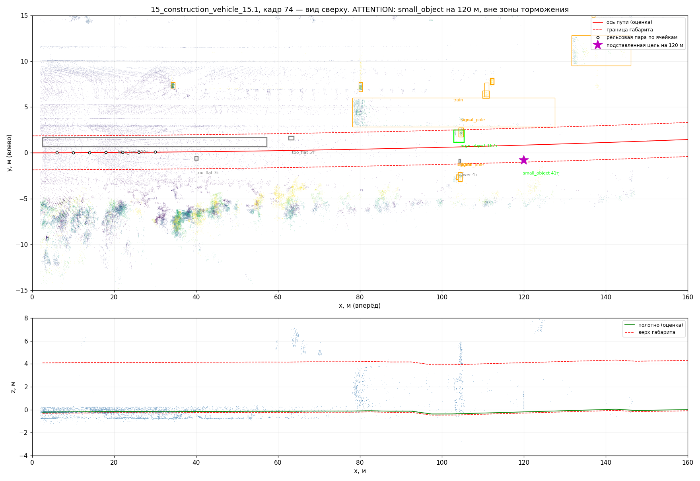

# Что измерено на реальных данных

Все цифры получены на записях **OSDaR23** — реальный лидарный комплект на
носу поезда (Гамбург, DB Netz AG). Полный вывод прогона лежит в
[`benchmark_output.txt`](benchmark_output.txt), воспроизводится одной командой:

```bash
./scripts/run_benchmark.sh
```

Три последовательности, 30 кадров, три принципиально разные сцены:

| Последовательность | Сцена | Чем сложна |
|---|---|---|
| `15_construction_vehicle_15.1` | прямой перегон, техника у пути | эталон «должно быть чисто» |
| `9_station_ruebenkamp_9.1` | платформа, люди рядом с путём | край платформы, сигналы, опоры вплотную к габариту |
| `7_approach_underground_station_7.1` | спуск к подземной станции | кривая R ≈ 250 м, стрелка, три соседних пути, выемка |

## 1. Точность поиска оси пути

Эталон — размеченные в датасете рельсы своего пути (`poly3d`); алгоритм ими
не пользуется, только облаком точек.

| Дальность | 15_construction | 9_ruebenkamp | 7_approach (кривая R≈250) |
|---|---|---|---|
| 0-20 м | **0.02 м** | **0.11 м** | **0.26 м** |
| 20-40 м | 0.06 м | 0.13 м | 1.15 м |
| 40-60 м | 0.12 м | 0.30 м | 3.95 м |
| 60-80 м | — | — | 8.02 м |

На прямой и в пологой кривой ось находится с точностью до дециметров на
всю дальность, где рельсы вообще разрешаются лидаром. В тугой кривой
R ≈ 250 м оценка успевает за путём в ближней зоне, но экстраполяция дуги
за 40 м расходится: на 70 м путь уходит вбок на 9.5 м, и ошибка в 8 м
означает, что коридор смотрит на соседний путь. Отсюда прямое следствие —
см. пункт 2 и раздел про путевую карту.

## 2. Ложные срабатывания на свободном пути

Во всех трёх записях путь перед поездом свободен (посторонних предметов в
габарите разметка не содержит), поэтому **любая команда торможения здесь —
ложная**. `ATTENTION` ложным срабатыванием не считается: это рекомендация
снизить скорость, а не вмешательство в движение.

| Последовательность | Свободно | Внимание | Служебное | Экстренное |
|---|---|---|---|---|
| `15_construction_vehicle_15.1` | 10 | 0 | 0 | 0 |
| `9_station_ruebenkamp_9.1` | 4 | 6 | 0 | 0 |
| `7_approach_underground_station_7.1` | 5 | 3 | **2** | 0 |
| **итого 30 кадров** | 19 | 9 | **2** | **0** |

Два ложных торможения — оба в тугой кривой, оба на опору контактной сети в
3.3 м от настоящей оси пути, попавшую в коридор из-за ошибки экстраполяции.
Ни одного ложного экстренного торможения.

**С осью пути из путевой карты** (`--route-prior`; на метрополитене
геометрия маршрута известна заранее) ложные торможения исчезают полностью:

| Последовательность | Свободно | Внимание | Служебное | Экстренное |
|---|---|---|---|---|
| `7_approach_underground_station_7.1` | 8 | 2 | **0** | 0 |
| остальные две | без изменений | | **0** | 0 |

## 3. Дальность детекции

В открытых записях с поездов посторонних предметов в габарите практически
нет — иначе поезд бы не поехал. Поэтому дальность меряется подстановкой
цели в реальный кадр с физически корректной плотностью точек: `n = k·A/r²`,
где `k = 7.8·10⁵` измерено по размеченным людям этого же датасета (человек
на 78 м — 118 точек, на 143 м — 63 точки; обе точки дают одно и то же `k`
с расхождением 5 %). Подробности — в [`DATASET.md`](DATASET.md).

Последовательность `15_construction_vehicle_15.1`, скорость 22 м/с
(79 км/ч), экстренный тормозной путь 199 м. «Детекций» — доля кадров с
подтверждённым треком, «торможений» — доля кадров с командой торможения.



*Подставленная цель (звёздочка) на 120 м и найденный по ней кластер из 41 точки.*

### Ось пути оценивается по облаку точек

| Дальность | Человек (0.88 м²) | | Предмет 40 см (0.16 м²) | |
|---|---|---|---|---|
| | точек | детекций | точек | детекций |
| 20 м | 1706 | 8/8 | 312 | 8/8 |
| 40 м | 427 | 8/8 | 78 | 5/8 |
| 60 м | 190 | 5/8 | 35 | 5/8 |
| 80 м | 107 | 6/8 | 19 | 2/8 |
| 100 м | 68 | 4/8 | 12 | 0/8 |
| 120 м | 47 | 7/8 | 9 | 0/8 |
| 140 м | 35 | 6/8 | 6 | 0/8 |
| 160 м | 27 | 6/8 | 5 | 0/8 |
| 180 м | 21 | 3/8 | 4 | 0/8 |

**Итог:** человек уверенно обнаруживается до **160 м**, предмет 40 см — до
**60 м**. Команда торможения при оценке оси по облаку выдаётся до 60 м:
дальше положение оси не подтверждено рельсами, и система сознательно
понижает уверенность до уровня «внимание».

### Ось пути из путевой карты

| Дальность | 40 | 60 | 80 | 100 | 120 | 140 | 160 | 180 |
|---|---|---|---|---|---|---|---|---|
| Человек, детекций | 7/8 | 7/8 | 8/8 | 7/8 | 8/8 | 5/8 | 3/8 | 2/8 |
| Человек, торможений | 7/8 | 7/8 | 8/8 | 7/8 | 8/8 | 5/8 | 3/8 | 2/8 |

**Команда торможения по человеку выдаётся до 140 м** — то есть внешняя ось
пути превращает «вижу, но не уверен» в полноценное решение. Это главный
аргумент в пользу интеграции с путевой картой метрополитена.

### Что это значит для допустимой скорости

Дальность обнаружения человека 140-160 м при времени реакции 0.6 с и
экстренном замедлении 1.3 м/с² соответствует безопасной скорости около
**18 м/с (65 км/ч)** — из уравнения `d = v·t + v²/(2a)`. Для более высоких
скоростей нужен либо более дальнобойный лидар, либо совместная работа с
камерой и радаром, для чего результат и публикуется в общий пайплайн.

## 4. Реальное время

| Этап | Медиана, мс |
|---|---|
| фильтрация | 14-19 |
| поверхность полотна | 9-12 |
| ось пути | 12-21 |
| коридор и отбор точек | 4-6 |
| снятие шума | 3-4 |
| кластеризация | 8-13 |
| объекты и решение | 5-6 |
| **весь кадр** | **53-100** |

Измерено на кадрах в 140-190 тысяч точек. Комплекс держит **10-17 Гц** при
частоте лидара 10 Гц; проверено не только офлайн, но и в собранной системе
ROS 2: `ros2 topic hz /rail_guard/obstacles` показывает 10.16 Гц при
времени обработки 67-75 мс на кадр.

## 5. Известные ограничения

1. **Тугая кривая без путевой карты.** Экстраполяция дуги за пределы зоны
   видимости рельсов даёт до 8 м ошибки на 70 м в кривой R = 250 м. Решения
   два, оба реализованы: понижение уверенности за зоной доверия (работает
   всегда) и внешняя ось пути (снимает проблему полностью).
2. **Предметы ниже 20 см** сознательно не выдаются как препятствия: на
   реальных данных они неотделимы от путевого оборудования и от погрешности
   оценки полотна. Порог вынесен в параметр `objects.min_size_z`.
3. **Стрелка.** Выбор ветви за стрелкой из облака точек однозначно не
   решается — нужна информация о маршруте от системы централизации.
   Ограничение непрерывности удерживает оценку на текущей ветви, но это
   эвристика, а не гарантия.
4. **Данные с магистральной дороги, а не из тоннеля метро.** Открытых
   лидарных записей из тоннелей метро в свободном доступе нет. Метрическая
   часть тракта от этого не зависит, но фильтр «свод тоннеля / кабельные
   консоли» (`objects.overhead_clearance`) проверен только на портале
   подземной станции в `7_approach_underground_station_7.1`.
5. **Оценка дальности зависит от модели плотности.** Коэффициент `k`
   измерен для сводного облака шести лидаров OSDaR23. Для другого комплекта
   его нужно перемерить — процедура описана в `DATASET.md`.
